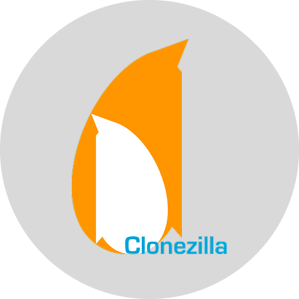

<p align="center">
  
</p>

# Ventoy Toolkit

> A professional multiboot USB toolkit for system administrators, developers, and security enthusiasts.

<p align="center">
  
  
  
  
  
  <br>
  
  
  
  
  
</p>

---

## Table of Contents

- [Overview](#overview)
- [Visual Guide](#visual-guide)
- [Toolkit Content](#toolkit-content)
- [Project Structure](#project-structure)
- [Custom Features](#custom-features)
- [Official Links](#official-links)

---

## Overview

Ta clé est un **multiboot toolkit** ultra-complet permettant de démarrer directement des fichiers ISO sans flashage à chaque utilisation. Elle est organisée pour répondre à tous les besoins : installation d'OS, dépannage Windows, forensic, pentesting et maintenance système.

| Category | Tools |
| :--- | :--- |
| **OS** | Arch Linux, Kali Linux, NixOS |
| **Windows / Recovery** | Hiren's BootCD PE |
| **Rescue** | SystemRescue |
| **Disk Management** | Clonezilla, GParted |
| **Hardware Diagnostic** | MemTest86+ |
| **Privacy & Anonymity** | Tails |

---

## Visual Guide

### Boot Menu & OS

| Ventoy Menu | Arch Linux | Kali Linux |
| :---: | :---: | :---: |
|  |  |  |

| NixOS | Windows PE | Tails |
| :---: | :---: | :---: |
|  |  |  |

### Utilities

| GParted | Clonezilla | SystemRescue | MemTest86+ |
| :---: | :---: | :---: | :---: |
|  |  |  |  |

---

## Toolkit Content

### Primary Systems

| | Tool | Description | ISO Filename |
| :---: | :--- | :--- | :--- |
|  | **Arch Linux** | Minimalist rolling release distribution. | `archlinux-x86_64.iso` |
|  | **Kali Linux** | Offensive security & pentesting (Persistent). | `kali-linux-live.iso` |
|  | **NixOS** | Declarative configuration-based OS. | `nixos-graphical-*.iso` |

### Rescue & Tools

| | Tool | Category | Key Features |
| :---: | :--- | :--- | :--- |
|  | **Hiren's BootCD PE** | Windows Recovery | Antivirus, Partitioning, Password Reset |
|  | **SystemRescue** | Linux Rescue | Boot repair, Filesystem recovery |
|  | **Clonezilla** | Disk Imaging | Disk cloning and massive deployment |
|  | **GParted** | Partitioning | Live partition editor (resize/move/repair) |
|  | **MemTest86+** | RAM Diagnostic | Hardware level memory testing |
|  | **Tails** | Privacy | Amnesic OS with Tor integrated |

---

## Project Structure

```text
/
├── assets/                 # Repository visual assets
│   ├── hero.png            # Hub Hero Image
│   ├── arch.png            # System Logos
│   ├── ...                 # Other Icons
│   └── screenshots/        # Tool & OS Screenshots
├── iso/                    # Main ISO storage
│   ├── ...
└── ventoy/                 # Ventoy configuration
    └── ventoy/
        ├── ventoy.json      # Theme, persistence, and alias config
        └── theme/           # Custom GRUB theme
```

---

## Custom Features

Ton setup n'est pas qu'une simple liste de fichiers. Il inclut des fonctionnalités avancées configurées dans `ventoy.json` :

*   **Custom Theme** : Thème "Squid" premium pré-installé.
*   **Custom Icons** : Icônes dédiées pour chaque OS (Arch, Kali, NixOS, Windows).
*   **Menu Aliases** : Noms de fichiers ISO renommés proprement dans le menu de boot.
*   **Kali Persistence** : Sauvegarde tes modifications sur Kali (`kali-persistence.dat`).
*   **Logic Organization** : Dossiers `/rescue` et `/tools` pour un menu propre.

---

## Official Links

### OS & ISOs
- [**Arch Linux**](https://archlinux.org/download/) - [Doc](https://wiki.archlinux.org/)
- [**Kali Linux**](https://www.kali.org/get-kali/) - [Doc](https://www.kali.org/docs/)
- [**NixOS**](https://nixos.org/download.html) - [Doc](https://nixos.org/manual/)
- [**Hiren's BootCD PE**](https://www.hirensbootcd.org/download/)
- [**SystemRescue**](https://www.system-rescue.org/Download/)
- [**Clonezilla**](https://clonezilla.org/downloads.php/)
- [**GParted**](https://gparted.org/download.php)
- [**MemTest86+**](https://memtest.org/)
- [**Tails**](https://tails.net/install/) - [Doc](https://tails.net/doc/)

### Bootloader
- [**Ventoy Official Website**](https://www.ventoy.net)
- [**Ventoy GitHub**](https://github.com/ventoy/Ventoy)

---

<p align="center">
  Generated by <b>Ventoy Toolkit Manager</b>
</p>
