<p align="center">
  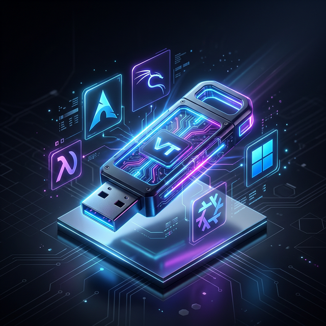
</p>

# Ventoy Toolkit

> A professional multiboot USB toolkit for system administrators, developers, and security enthusiasts.

<p align="center">
  
  
  
  
  
  
  
  
  
  
</p>

---

## Table of Contents

- [Overview](#overview)
- [Visual Guide](#visual-guide)
- [Toolkit Content](#toolkit-content)
- [Project Structure](#project-structure)
- [Custom Features](#custom-features)
- [Official Links](#official-links)

---

## Overview

Ta clé est un **multiboot toolkit** ultra-complet permettant de démarrer directement des fichiers ISO sans flashage à chaque utilisation. Elle est organisée pour répondre à tous les besoins : installation d'OS, dépannage Windows, forensic, pentesting et maintenance système.

---

## Visual Guide

### Ventoy Boot Menu
Le point d'entrée de ton toolkit avec le thème personnalisé.

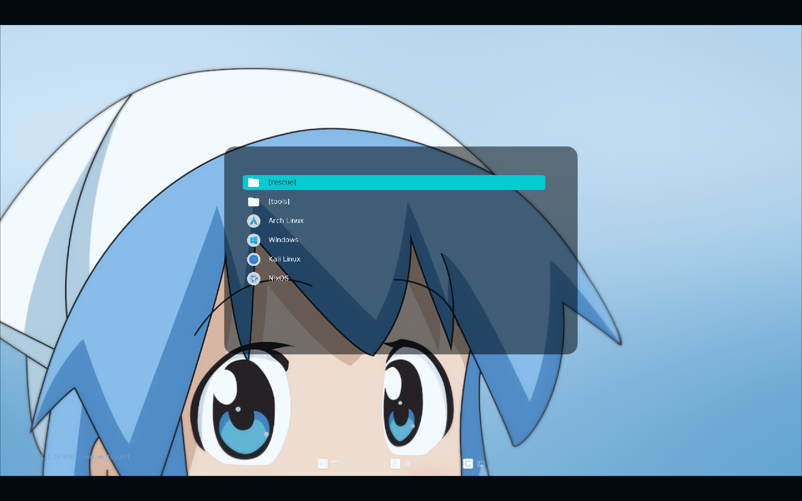

### Primary Operating Systems
Les systèmes d'exploitation mobiles et robustes prêts à l'emploi.

#### Arch Linux
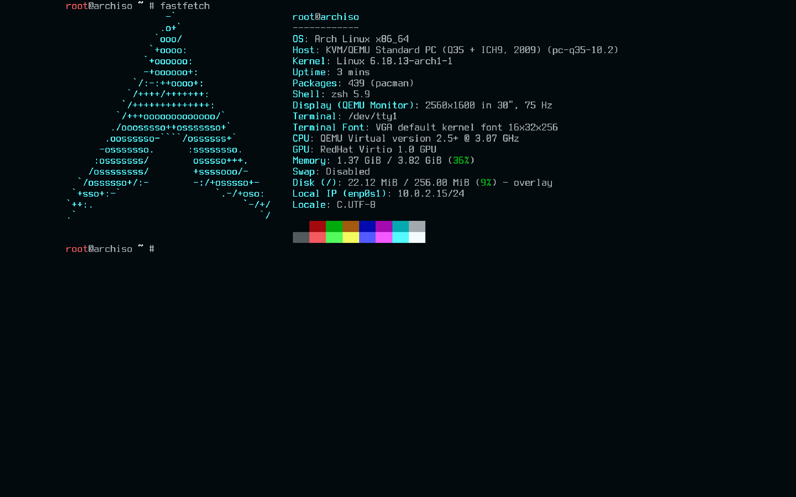

#### Kali Linux
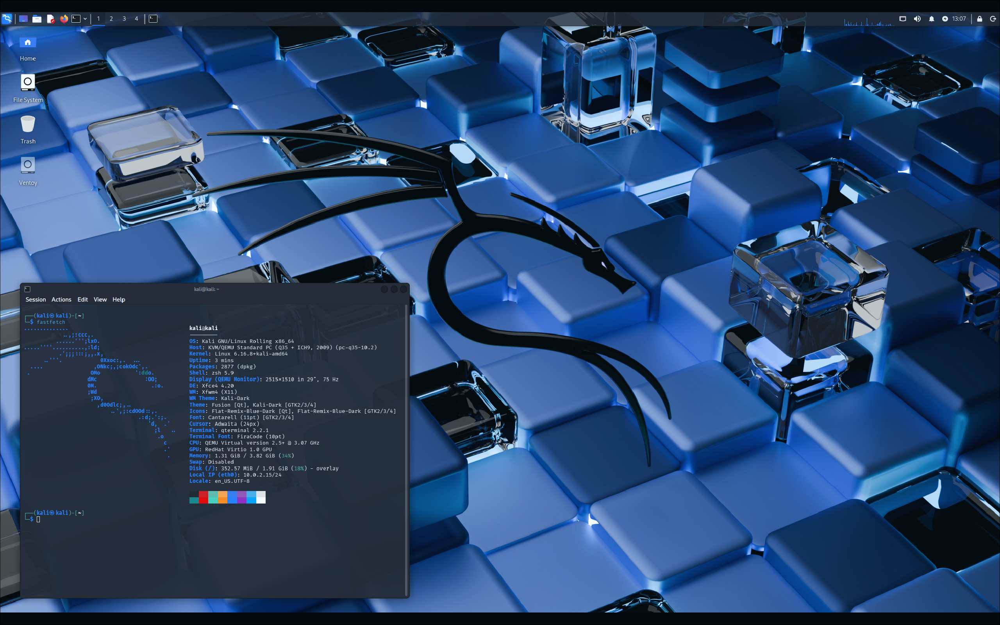

#### NixOS
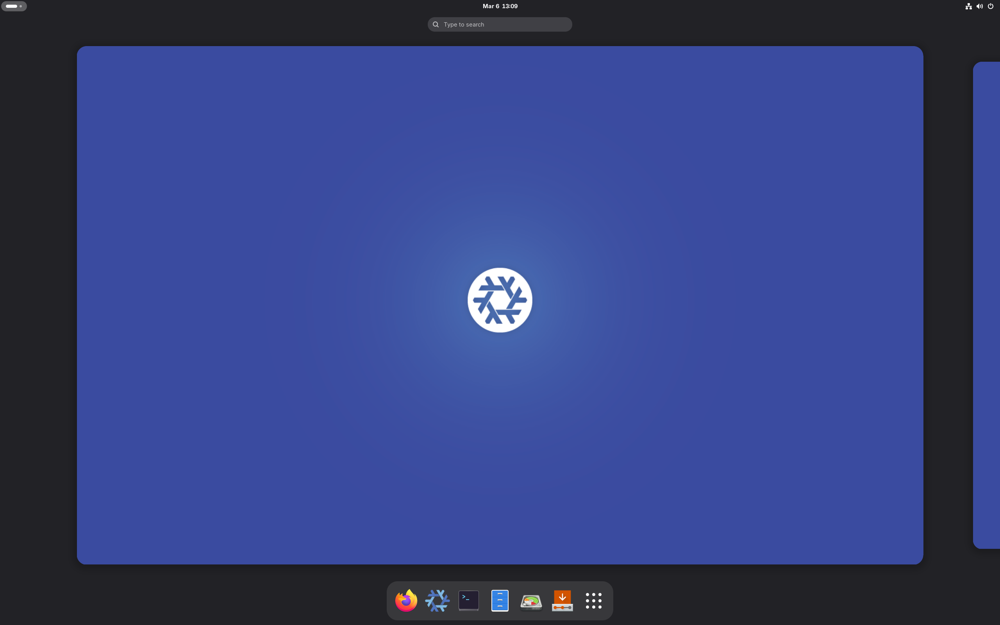

### Recovery & Specialized Tools
Outils de diagnostic, partitionnement et maintenance.

#### Windows PE (Hiren's BootCD)
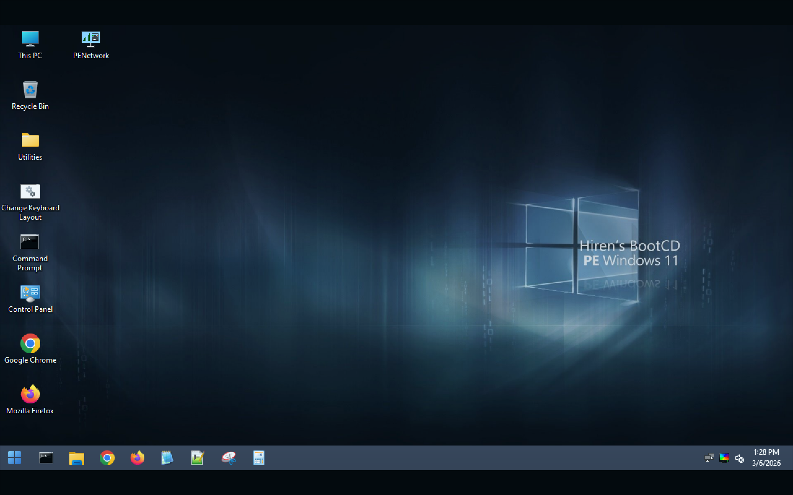

#### Tails (Privacy)
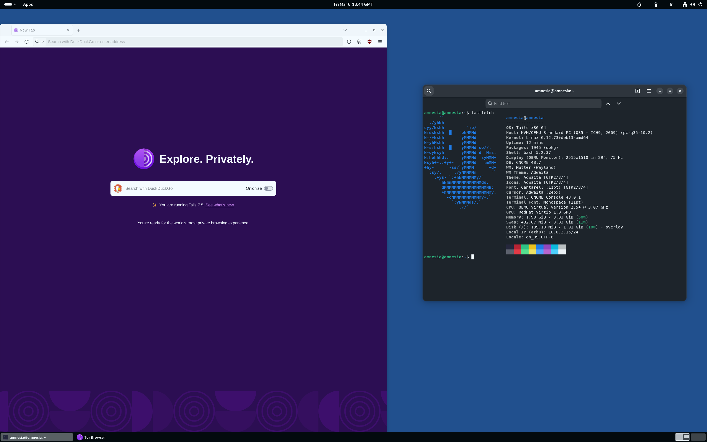

#### GParted
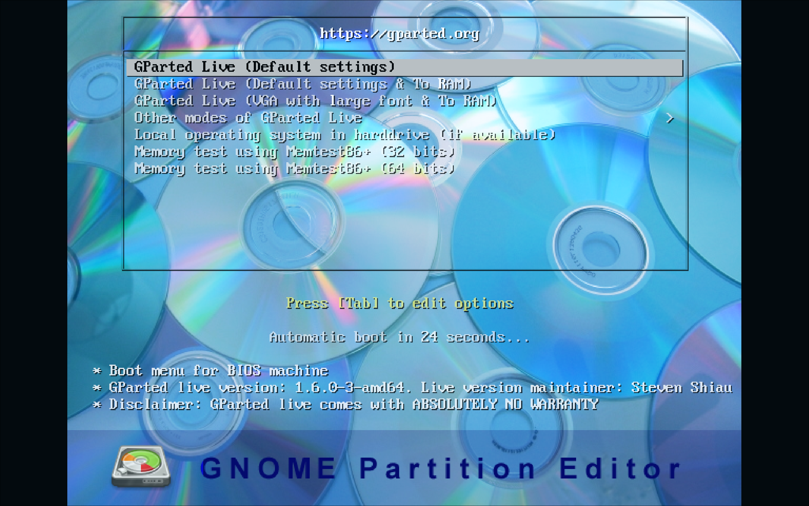

#### Clonezilla
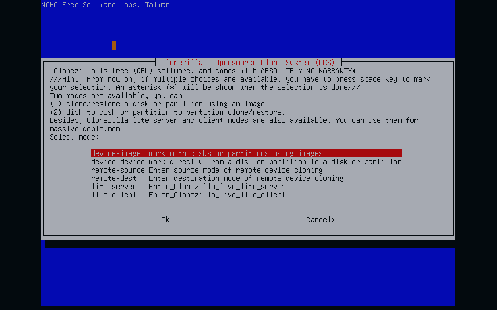

#### SystemRescue
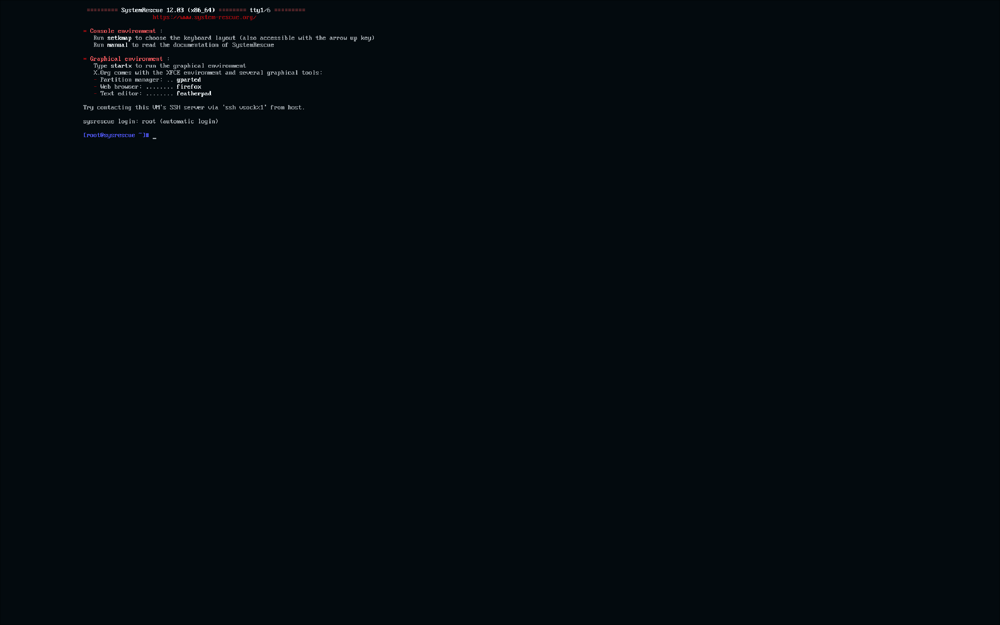

#### MemTest86+
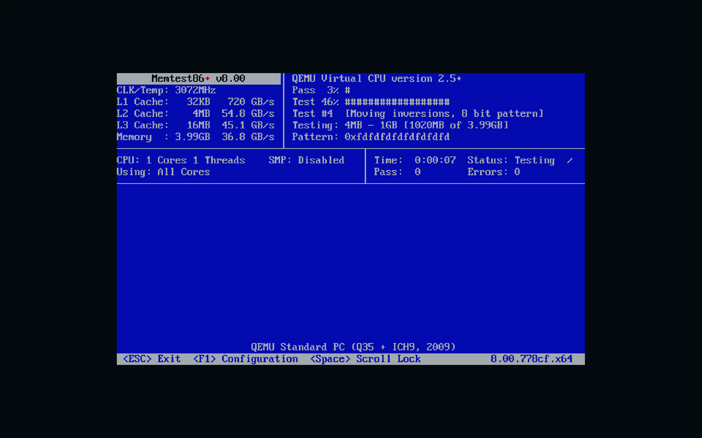

---

## Toolkit Content

### Primary Systems

**Arch Linux**
Minimalist rolling release distribution.
`archlinux-x86_64.iso`

**Kali Linux**
Offensive security & pentesting (Persistent).
`kali-linux-live.iso`

**NixOS**
Declarative configuration-based OS.
`nixos-graphical-*.iso`

### Rescue & Tools

**Hiren's BootCD PE**
Windows Recovery environment with Antivirus, Partitioning, and Password Reset tools.

**SystemRescue**
Linux Rescue toolkit for boot repair and filesystem recovery.

**Clonezilla**
Disk Imaging tool for cloning and massive deployment.

**GParted**
Live partition editor for resizing,moving, and repairing partitions.

**MemTest86+**
Hardware level memory testing utility.

**Tails**
Amnesic OS with Tor integrated for ultimate privacy.

---

## Project Structure

```text
/
├── assets/                 # Repository visual assets
│   ├── hero.png            # Hub Hero Image
│   └── screenshots/        # Tool & OS Screenshots
├── iso/                    # Main ISO storage
│   ├── archlinux-x86_64.iso
│   ├── kali-linux-live.iso
│   ├── nixos-graphical.iso
│   ├── HBCD_PE_x64.iso
│   ├── rescue/
│   │   └── systemrescue.iso
│   └── tools/
│       ├── clonezilla.iso
│       ├── gparted.iso
│       ├── memtest.iso
│       └── tails.iso
└── ventoy/                 # Ventoy configuration
    └── ventoy/
        ├── ventoy.json      # Theme, persistence, and alias config
        └── theme/           # Custom GRUB theme
```

---

## Custom Features

Ton setup n'est pas qu'une simple liste de fichiers. Il inclut des fonctionnalités avancées configurées dans `ventoy.json` :

- **Custom Theme** : Thème "Squid" premium pré-installé.
- **Custom Icons** : Icônes dédiées pour chaque OS (Arch, Kali, NixOS, Windows).
- **Menu Aliases** : Noms de fichiers ISO renommés proprement dans le menu de boot.
- **Kali Persistence** : Sauvegarde tes modifications sur Kali (`kali-persistence.dat`).
- **Logic Organization** : Dossiers `/rescue` et `/tools` pour un menu propre.

---

## Official Links

### OS & ISOs
- [**Arch Linux**](https://archlinux.org/download/) - [Doc](https://wiki.archlinux.org/)
- [**Kali Linux**](https://www.kali.org/get-kali/) - [Doc](https://www.kali.org/docs/)
- [**NixOS**](https://nixos.org/download.html) - [Doc](https://nixos.org/manual/)
- [**Hiren's BootCD PE**](https://www.hirensbootcd.org/download/)
- [**SystemRescue**](https://www.system-rescue.org/Download/)
- [**Clonezilla**](https://clonezilla.org/downloads.php/)
- [**GParted**](https://gparted.org/download.php)
- [**MemTest86+**](https://memtest.org/)
- [**Tails**](https://tails.net/install/) - [Doc](https://tails.net/doc/)

### Bootloader
- [**Ventoy Official Website**](https://www.ventoy.net)
- [**Ventoy GitHub**](https://github.com/ventoy/Ventoy)

---

<p align="center">
  Generated by <b>Ventoy Toolkit Manager</b>
</p>
